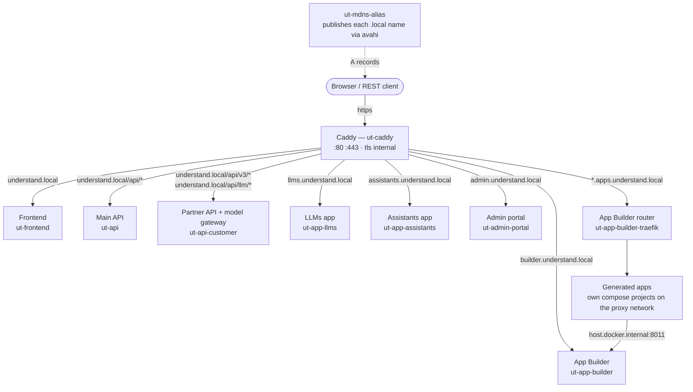
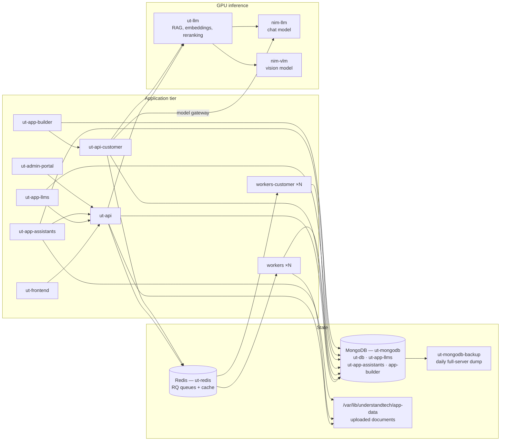

# UnderstandTech — AI in a Box

Deploy the UnderstandTech platform on NVIDIA DGX Spark systems using Docker Compose.

Everything runs on the box: the web platform, the satellite apps, the model
gateway, and GPU inference. Nothing leaves the network.

## Architecture

### Ingress and surfaces

Caddy terminates TLS for every hostname and is the only container publishing
80/443. Each `.local` name is announced separately over mDNS by the
`ut-mdns-alias` service, because mDNS has no wildcards.



### Data and inference



## What's in This Repo

| File | Purpose |
|---|---|
| `compose.yaml` | Docker Compose stack — all services, networks, volumes |
| `compose.appbuilder.yaml` | Optional App Builder add-on — off unless enabled in `.env` |
| `Caddyfile` | Reverse proxy config — one site block per hostname |
| `.env.example` | Template for `.env` — image tags, credentials, model config |
| `setup-autostart.sh` | Installs the systemd boot service and the mDNS alias publisher |
| `ut-logs-archive` | Automated daily log archival with compression and retention |
| `appbuilder/traefik/` | Static routing config for the App Builder's per-app router |

## Quick Start

```bash
# 1. Clone and configure
git clone https://dgx-access:<TOKEN>@github.com/understand-tech/ai-in-a-box.git ~/understand-tech
cd ~/understand-tech
cp .env.example .env
chmod 600 .env
# Edit .env — set MONGODB_USERNAME, MONGODB_PASSWORD, JWT_SECRET at minimum

# 2. If the App Builder is enabled in .env, create the network its
#    generated apps attach to (once per box)
docker network create proxy

# 3. Pull images and start
docker compose pull
docker compose up -d

# 4. Verify
docker compose ps
```

Access the platform at `https://understand.local` once all services are healthy.
The first pull takes 10–20 minutes; the first NIM start takes longer still while
the model cache fills.

`docker compose` reads `.env` from this directory for both interpolation and its
own settings — `COMPOSE_FILE` (which overlays the App Builder) and
`COMPOSE_PROFILES` (which enables the NIM containers) are set there, so always
run compose from the repository root.

## Services

Only Caddy, MongoDB, the NIM containers and the App Builder publish host ports.
Everything else is reachable only from inside the Docker networks.

| Service | Container | Host port | Description |
|---|---|---|---|
| Caddy | `ut-caddy` | 80, 443 | HTTPS reverse proxy with internal TLS |
| Frontend | `ut-frontend` | — | React web application |
| API | `ut-api` | — | Main backend API (FastAPI), `:8501` internal |
| API-Customer | `ut-api-customer` | — | Partner (REST v3) API and model gateway, `:8501` internal |
| Workers | `understandtech-workers-*` | — | RQ background jobs on the `ut-api` queue |
| Workers-Customer | `understandtech-workers-customer-*` | — | RQ background jobs on the `ut-api-partners` queue |
| LLMs App | `ut-app-llms` | — | Model catalogue and playground, at `llms.understand.local` |
| Assistants App | `ut-app-assistants` | — | Assistant builder, at `assistants.understand.local` |
| Admin Portal | `ut-admin-portal` | — | Tenant and user administration, at `admin.understand.local` |
| LLM | `ut-llm` | — | RAG, embeddings and reranking on GPU, `:8000` internal |
| NIM LLM | `nim-llm` | 8001 | NVIDIA NIM serving the chat model (profile `nim`) |
| NIM VLM | `nim-vlm` | 8002 | NVIDIA NIM serving the vision model (profile `nim`) |
| MongoDB | `ut-mongodb` | 27018 | Document database (container port 27017) |
| Redis | `ut-redis` | — | Task queue and cache |
| MongoDB Backup | `ut-mongodb-backup` | — | Daily full-server dump of every database |
| App Builder | `ut-app-builder` | 8011 (`APP_BUILDER_HOST_PORT`) | Builds and hosts generated apps (add-on) |
| App Builder Router | `ut-app-builder-traefik` | — | Per-app routing for generated apps (add-on) |

`nim-llm` and `nim-vlm` sit behind compose profiles, so they only start when
`COMPOSE_PROFILES` includes `nim` (or `nim-llm` / `nim-vlm` individually).
`.env.example` sets `COMPOSE_PROFILES="nim"`.

The worker services scale with `WORKER_REPLICAS` and `WORKER_CUSTOMER_REPLICAS`,
so they get compose-generated names rather than fixed `container_name` values.

## Hostnames

| Hostname | Served by | Notes |
|---|---|---|
| `understand.local` | `frontend`, `api`, `api-customer` | `/api/*` → API, `/api/v3/*` and `/api/llm/*` → partner API |
| `llms.understand.local` | `app-llms` | |
| `assistants.understand.local` | `app-assistants` | |
| `admin.understand.local` | `admin-portal` | `/api/*` → main API |
| `builder.understand.local` | `app-builder` | App Builder add-on |
| `<app>.apps.understand.local` | `app-builder-traefik` | One per generated app, plus `--staging` and `--prod` |

Caddy serves the generated apps from a single wildcard site, so no config change
is needed per app — but each hostname is announced over mDNS individually
because mDNS has no wildcards. The alias service rescans the App Builder's
traefik directory every 10 seconds, so a new app resolves within about that long.

## Networks

The stack uses two isolated Docker bridge networks, plus one external network
for the App Builder:

- **`ut-frontend-network`** — everything Caddy has to reach: `caddy`, `frontend`,
  `api`, `api-customer`, `app-llms`, `app-assistants`, `admin-portal`,
  `app-builder`, `app-builder-traefik`, the workers, `llm`, `mongodb` and the
  NIM containers.
- **`ut-backend-network`** (internal, no external access) — `api`,
  `api-customer`, the workers, `app-assistants`, `admin-portal`, `llm`,
  the NIM containers, `redis`, `mongodb` and `mongodb-backup`.
- **`proxy`** (external, App Builder only) — shared with the generated apps'
  own compose projects, so no single project owns it. Create it once with
  `docker network create proxy`; `setup-autostart.sh` also creates it if the
  overlay is enabled.

## Volumes

| Volume | Purpose |
|---|---|
| `ut-caddy-data` | Caddy TLS certificates and state |
| `ut-caddy-config` | Caddy configuration |
| `ut-redis-data` | Redis AOF persistence |
| `ut-mongodb-data` | MongoDB database files |
| `ut-mongodb-backup` | Compressed backup archives |
| `ut-uploads-data` | Shared upload scratch space (API + workers) |
| `ut-llm-ollama` | Ollama configuration |
| `ut-llm-models` | LLM model files |
| `ut-vllm-models` | Hugging Face cache for the LLM service |
| `ut-nim-llm-cache` | NIM chat-model weights (survives updates — do not prune casually) |
| `ut-nim-vlm-cache` | NIM vision-model weights (idem) |

Two host paths are bind-mounted rather than kept in volumes:

| Host path | Mounted by | Purpose |
|---|---|---|
| `/var/lib/understandtech/app-data` | `api`, `api-customer`, both worker sets, `app-assistants`, `llm` | Uploaded documents and generated artefacts (`/app/storage`) |
| `/var/lib/understandtech/appbuilder` | `app-builder`, `app-builder-traefik` | `workspaces/`, `prod-workspaces/`, `traefik-dynamic/` |

The App Builder's projects live on the host because it starts each generated app
as its own compose project, and the docker daemon has to be able to resolve
those paths. `setup-autostart.sh` creates both trees.

## Backups

`ut-mongodb-backup` takes one **full-server dump** every 24 hours — a single
gzipped `mongodump --archive` covering every database on the instance: `ut-db`,
`ut-app-llms`, `ut-app-assistants`, `app-builder`, and anything a future app
adds. Archives land in the `ut-mongodb-backup` volume and are pruned after 30
days (`BACKUP_CLEANUP_TIME`, in minutes).

Tunable from `.env`: `BACKUP_BEGIN` (HHMM, default `1520`), `BACKUP_INTERVAL`
(minutes, default `1440`), `BACKUP_CLEANUP_TIME`, `BACKUP_COMPRESSION`,
`BACKUP_COMPRESSION_LEVEL`.

Restores run from the `mongodb-backup` container: it is the one that holds the
archives and it already has the credentials in its environment, so nothing
sensitive lands in your shell history.

```bash
# List archives
docker compose exec mongodb-backup ls -lh /backup

# Take one right now instead of waiting for the window
docker compose exec mongodb-backup backup-now

# Restore everything
docker compose exec mongodb-backup sh -c '
  mongorestore --host mongodb --port 27017 \
    -u "$DB01_USER" -p "$DB01_PASS" --authenticationDatabase admin \
    --gzip --archive=/backup/<file>.archive.gz'

# Restore a single application database out of the same archive
docker compose exec mongodb-backup sh -c '
  mongorestore --host mongodb --port 27017 \
    -u "$DB01_USER" -p "$DB01_PASS" --authenticationDatabase admin \
    --gzip --archive=/backup/<file>.archive.gz --nsInclude="ut-app-llms.*"'
```

`mongorestore` merges into existing collections by default; add `--drop` to
replace them instead. The image also ships an interactive `restore` helper, but
it targets a single named database and does not fit these whole-server
archives — use the commands above.

Not covered by this container: `/var/lib/understandtech/app-data` (uploaded
documents) and `/var/lib/understandtech/appbuilder` (generated app source).
Back those up with the host's own snapshot or file-level backup.

> **Upgrading from an earlier release:** backups used to be scoped to `ut-db`
> alone and were named `mongo_ut-db_mongodb_*.archive.gz`. Full-server dumps are
> named `mongo__mongodb_*.archive.gz`, so the retention sweep no longer matches
> the old files. Delete them by hand once you are satisfied with the new
> archives, or they will sit in the volume indefinitely.

## Common Operations

```bash
# View logs
docker compose logs -f api
docker compose logs -f llm

# Restart a service
docker compose restart api

# Scale workers
docker compose up -d --scale workers=4

# Update to latest
git pull
docker compose pull
docker compose up -d

# Install log archival cron job
chmod +x ut-logs-archive
./ut-logs-archive --install
```

## Auto-Start on Boot

`setup-autostart.sh` installs two systemd units: `understandtech.service`, which
brings the compose stack up at boot, and `ut-mdns-alias.service`, which publishes
the satellite and generated-app hostnames over mDNS.

```bash
# Install both, using this checkout as the install directory
sudo ./setup-autostart.sh

# Publish only the mDNS names
sudo ./setup-autostart.sh --mdns

# Status of both units plus every compose service
sudo ./setup-autostart.sh --status

# Remove
sudo ./setup-autostart.sh --uninstall
```

| Flag | Effect |
|---|---|
| `--dir PATH` | Install directory. Defaults to the directory holding the script, so a normal `sudo ./setup-autostart.sh` from the checkout is correct. |
| `--yes` | Never prompt. Also assumed when stdin is not a terminal, so the script is safe to call from provisioning. |

The install runs a preflight first — Docker and Compose V2 present, `.env` and
`compose.yaml` in place, `docker compose config` parsing cleanly — and creates
the host directories and the `proxy` network when the App Builder overlay is
enabled.

The service unit sets `WorkingDirectory` and lets `docker compose` read `.env`
itself. It deliberately does not use `EnvironmentFile`: systemd's parser strips
quotes that compose keeps, and anything systemd exported would take precedence
over `.env`, so the stack would boot with different values than a manual
`docker compose up -d` produces.

Published mDNS names come from `/etc/default/ut-mdns-alias`. That file is
created once and never overwritten, so names added there survive re-running the
installer:

```bash
sudo nano /etc/default/ut-mdns-alias
sudo systemctl restart ut-mdns-alias
```

mDNS publishing needs avahi. If it is missing the installer says so and leaves
the unit enabled but stopped:

```bash
sudo apt-get install -y avahi-daemon avahi-utils
sudo systemctl start ut-mdns-alias
```

## App Builder Add-On

Lets users describe an app and have it built, then serves the result on the same
box. It runs in the same compose project as everything else and talks to
`api-customer` for models and UT API v3 — nothing leaves the network.

```bash
# 1. Enable the overlay in .env and set the gateway key
#    COMPOSE_FILE="compose.yaml:compose.appbuilder.yaml"
#    APP_BUILDER_GATEWAY_API_KEY="..."   # platform UI: Account -> API keys

# 2. Create the network generated apps attach to (once per box; it is
#    shared with their compose projects, so no single project owns it)
docker network create proxy

# 3. Start it, and publish the mDNS names
docker compose up -d
sudo ./setup-autostart.sh --mdns
```

The builder is at `https://builder.understand.local`; each generated app gets
`https://<project>.apps.understand.local` plus `--staging` and `--prod` surfaces.

`APP_BUILDER_HOST_PORT` is published on the host because generated apps run in
their own compose projects and reach the builder's model proxy at
`host.docker.internal:<port>` — docker DNS cannot get them there.

## Documentation

Full setup and administration guides can be found at https://docs.understand.tech

- **Installation & Setup** — DGX first-boot, platform deployment, SSL certificates, first-time app config
- **Portainer Guide** — Web-based container management
- **Logging Guide** — Real-time logs, automated archival, log analysis
- **MongoDB & Backups** — Database operations, backup/restore procedures

## Requirements

- NVIDIA DGX Spark (ARM64) with DGX OS
- Docker Engine 24.0+ with Compose V2
- NVIDIA Container Toolkit (pre-installed on DGX)
- `avahi-daemon` and `avahi-utils` for the `.local` hostnames
- GitHub Container Registry access (provided by UnderstandTech) — this covers
  the NVIDIA NIM inference containers too. They are re-hosted on the
  UnderstandTech GHCR, so `docker compose pull` fetches them like any other
  image and **no NVIDIA NGC account or API key is required on the box**.
