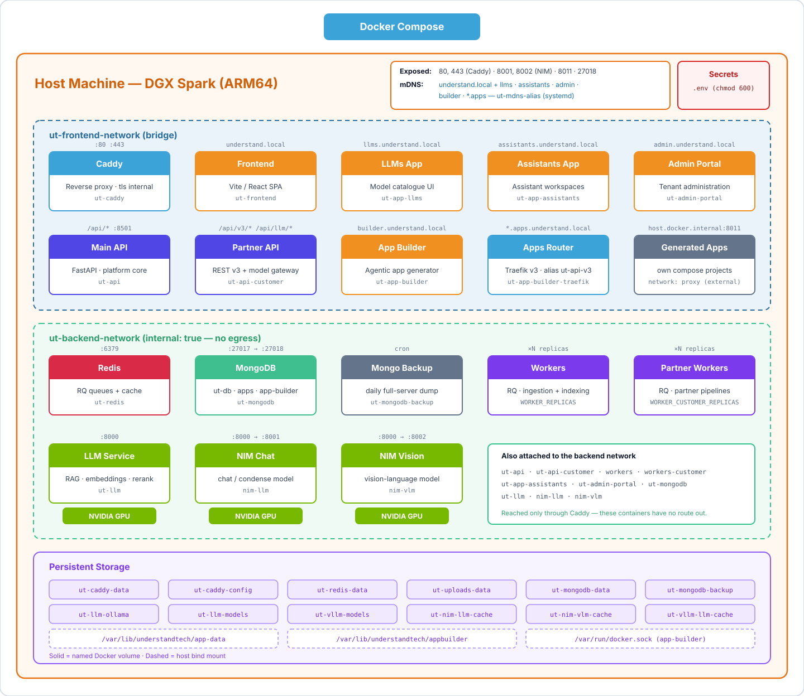

# UnderstandTech — AI in a Box

Deploy the UnderstandTech platform on NVIDIA DGX Spark systems using Docker Compose.

Everything runs on the box: the web platform, the satellite apps, the model
gateway, and GPU inference. Nothing leaves the network.

## Architecture



Caddy terminates TLS for every hostname and is the only container publishing
80/443. Every hostname derives from one setting, `UT_DOMAIN` — see
[Domain, TLS and proxy](#domain-tls-and-proxy). Each `.local` name is announced
separately over mDNS by the `ut-mdns-alias` systemd unit, because mDNS has no
wildcards; that includes the apex, so the box's own host name does not have to
match the domain. Everything the platform stores or infers on sits on
`ut-backend-network`, which is `internal: true` — those containers have no route
off the box.

## What's in This Repo

| File | Purpose |
|---|---|
| `compose.yaml` | Docker Compose stack — all services, networks, volumes |
| `compose.appbuilder.yaml` | App Builder add-on — enabled by `COMPOSE_FILE` in `.env`, which `.env.example` ships switched on |
| `Caddyfile` | Reverse proxy config — one site block per surface, hostnames from `UT_DOMAIN` |
| `caddy/ingress-*.caddy` | One per ingress mode — global options and the `(tls)` snippets |
| `caddy/certs/` | Where a `custom`-mode certificate goes (gitignored) |
| `.env.example` | Template for `.env` — domain and TLS, image tags, credentials, model config |
| `setup-autostart.sh` | Installs the systemd boot service and the mDNS alias publisher; `--check` validates domain/TLS settings |
| `ut-logs-archive` | Automated daily log archival with compression and retention |
| `appbuilder/traefik/` | Static routing config for the App Builder's per-app router |
| `docs/architecture.svg` | Source of the architecture diagram above |

## Quick Start

```bash
# 1. Clone and configure
git clone https://dgx-access:<TOKEN>@github.com/understand-tech/ai-in-a-box.git ~/understand-tech
cd ~/understand-tech
cp .env.example .env
chmod 600 .env
# Edit .env — set MONGODB_USERNAME, MONGODB_PASSWORD, JWT_SECRET at minimum.
# Leave UT_DOMAIN alone for a single box on understand.local; see
# "Domain, TLS and proxy" to serve another name or a second appliance.

# 2. Create the network the App Builder's generated apps attach to (once per
#    box). .env.example ships with the add-on enabled, so this is required
#    unless you comment COMPOSE_FILE out — the network is external, and
#    `docker compose up` fails outright when it is missing.
docker network create proxy

# 3. Check the domain / TLS settings before deploying (changes nothing)
sudo ./setup-autostart.sh --check

# 4. Pull images and start
docker compose pull
docker compose up -d

# 5. Verify
docker compose ps

# 6. Make it survive a reboot (installs the systemd units and the mDNS names)
sudo ./setup-autostart.sh
```

Access the platform at `https://understand.local` — or at whatever `UT_DOMAIN`
you set — once all services are healthy.
The first pull takes 10–20 minutes; the first NIM start takes longer still while
the model cache fills.

`docker compose` reads `.env` from this directory for both interpolation and its
own settings — `COMPOSE_FILE` (which overlays the App Builder) and
`COMPOSE_PROFILES` (which enables the NIM containers) are set there, so always
run compose from the repository root.

## Services

Only Caddy, MongoDB, the NIM containers and the App Builder publish host ports.
Everything else is reachable only from inside the Docker networks.

| Service | Container | Host port | Description |
|---|---|---|---|
| Caddy | `ut-caddy` | 80, 443 | Reverse proxy; TLS per `UT_INGRESS_MODE` (self-signed by default) |
| Frontend | `ut-frontend` | — | React web application |
| API | `ut-api` | — | Main backend API (FastAPI), `:8501` internal |
| API-Customer | `ut-api-customer` | — | Partner (REST v3) API and model gateway, `:8501` internal |
| Workers | `understandtech-workers-*` | — | RQ background jobs on the `ut-api` queue |
| Workers-Customer | `understandtech-workers-customer-*` | — | RQ background jobs on the `ut-api-partners` queue |
| LLMs App | `ut-app-llms` | — | Model catalogue and playground, at `llms.understand.local` |
| Assistants App | `ut-app-assistants` | — | Assistant builder, at `assistants.understand.local` |
| Admin Portal | `ut-admin-portal` | — | Tenant and user administration, at `admin.understand.local` |
| LLM | `ut-llm` | — | RAG, embeddings and reranking on GPU, `:8000` internal |
| NIM LLM | `nim-llm` | 8001 | NVIDIA NIM serving the chat model (profile `nim`) |
| NIM VLM | `nim-vlm` | 8002 | NVIDIA NIM serving the vision model (profile `nim`) |
| MongoDB | `ut-mongodb` | 27018 | Document database (container port 27017) |
| Redis | `ut-redis` | — | Task queue and cache |
| MongoDB Backup | `ut-mongodb-backup` | — | Daily full-server dump of every database |
| App Builder | `ut-app-builder` | 8011 (`APP_BUILDER_HOST_PORT`) | Builds and hosts generated apps (add-on) |
| App Builder Router | `ut-app-builder-traefik` | — | Per-app routing for generated apps (add-on) |

`nim-llm` and `nim-vlm` sit behind compose profiles, so they only start when
`COMPOSE_PROFILES` includes `nim` (or `nim-llm` / `nim-vlm` individually).
`.env.example` sets `COMPOSE_PROFILES="nim"`.

The worker services scale with `WORKER_REPLICAS` and `WORKER_CUSTOMER_REPLICAS`,
so they get compose-generated names rather than fixed `container_name` values.

## Hostnames

Every name is derived from `UT_DOMAIN`, which defaults to `understand.local`.
The table shows that default; change the one setting and all six follow.

| Hostname | Served by | Notes |
|---|---|---|
| `understand.local` | `frontend`, `api`, `api-customer` | `/api/*` → API, `/api/v3/*` and `/api/llm/*` → partner API |
| `llms.understand.local` | `app-llms` | |
| `assistants.understand.local` | `app-assistants` | |
| `admin.understand.local` | `admin-portal` | `/api/*` → main API |
| `builder.understand.local` | `app-builder` | App Builder add-on |
| `<app>.apps.understand.local` | `app-builder-traefik` | One per generated app, plus `--staging` and `--prod` |

Caddy serves the generated apps from a single wildcard site, so no config change
is needed per app — but each hostname is announced over mDNS individually
because mDNS has no wildcards. The alias service rescans the App Builder's
traefik directory every 10 seconds, so a new app resolves within about that long.

## Domain, TLS and proxy

`UT_DOMAIN` in `.env` is the only place the appliance's public name is written.
Every URL the services need — `PUBLIC_BASE_URL`, `REDIRECT_URI`, `BACKEND_URL`,
`DOMAIN_URL`, the `VITE_*` pair, `EXTRA_ALLOWED_ORIGINS`, the `APP_LLMS_*`,
`APP_ASSISTANTS_*` and `APP_BUILDER_*` families, `GATEWAY_PUBLIC_URL` — is
derived from it in the `x-public-urls` block of `compose.yaml`, and so are the
Caddy site addresses and the published mDNS names. Moving the box to another
domain is a one-line change.

Each derived URL stays individually overridable: a value written explicitly in
`.env` wins over the derived default. That is also what makes this change
backwards compatible — a `.env` from an earlier release still carries all
nineteen URL lines, so it keeps producing exactly the values it did before.

```bash
UT_DOMAIN="understand.local"   # the public name
UT_INGRESS_MODE="internal"     # internal | custom | edge
```

### The three ingress modes

| Mode | Who holds the certificate | What you supply | Caddy listens on |
|---|---|---|---|
| `internal` | Caddy's own internal CA, self-signed | nothing | `:443` |
| `custom` | you | `fullchain.pem` + `privkey.pem` in `UT_CERT_DIR` | `:443` |
| `edge` | your reverse proxy or load balancer | nothing on the box | `:80`, plain HTTP |

`internal` is the default and the only mode that works on a `.local` domain: no
public authority issues for `.local`. Each mode is a small file under `caddy/`
holding that mode's global options and its `(tls)` snippets; compose bind-mounts
the one `UT_INGRESS_MODE` names.

### Two schemes, not one

This is the part that catches people. Behind a load balancer there are two
different answers to "http or https":

| Setting | Meaning | Value behind a TLS-terminating proxy |
|---|---|---|
| `UT_CADDY_SCHEME` | the scheme **Caddy listens on** | `http` |
| `UT_PUBLIC_SCHEME` | the scheme **the apps advertise** to the browser | `https` |

The load balancer speaks plain HTTP to Caddy, so Caddy must not expect to hold a
certificate — but the browser is on HTTPS, so every absolute URL and OIDC
redirect the apps generate has to say `https`. One variable for both would
necessarily be wrong at one end.

`UT_TRUSTED_PROXIES` completes the picture: it tells Caddy which sources may set
`X-Forwarded-*`, so the proxy's `X-Forwarded-Proto: https` is honoured and client
IPs are real in the logs. Narrow it to your proxy's network — the default,
`private_ranges`, lets any machine on the LAN spoof its source address.

```bash
# Example: test.toto, TLS terminated on a load balancer at 10.42.0.0/16
UT_DOMAIN="test.toto"
UT_INGRESS_MODE="edge"
UT_CADDY_SCHEME="http"
UT_PUBLIC_SCHEME="https"
UT_TRUSTED_PROXIES="10.42.0.0/16"
```

### Certificate coverage in `custom` mode

The certificate must cover the apex and the four satellite names. The generated
apps sit two levels down, at `*.apps.<domain>`, which a single-level wildcard
does **not** match — supply a second wildcard through `UT_APPS_CERT_FILE` and
`UT_APPS_KEY_FILE` if you run the App Builder.

Note that `caddy validate` provisions certificates for real, so a missing file
stops Caddy from starting rather than degrading quietly. Check before deploying:

```bash
sudo ./setup-autostart.sh --check
```

That reports the effective settings, catches the combinations neither
`docker compose config` nor Caddy rejects on their own — a typo in
`UT_INGRESS_MODE`, `edge` left on `UT_CADDY_SCHEME="https"`, a certificate whose
SANs miss a hostname — and finally adapts the whole config with the same Caddy
image the stack runs. It changes nothing.

### Names outside `.local`

mDNS answers for `.local` and nothing else, so on any other domain the
`ut-mdns-alias` service detects it, reports that mDNS does not apply and stops
cleanly instead of retrying forever. Create the records in your own DNS,
pointing at the box or at the proxy in front of it:

```
<domain>  llms.<domain>  assistants.<domain>  admin.<domain>  builder.<domain>  *.apps.<domain>
```

Two things live outside this repo and have to follow by hand: the **redirect URI
allowed by your OIDC provider** must match the new `REDIRECT_URI`, and **App
Builder apps generated before the change** keep the old hostname in their traefik
files until they are redeployed.

## Running two appliances

Two boxes on the same network need two distinct `UT_DOMAIN` values — otherwise
both publish the same mDNS name and clients reach whichever answers first. That
is the whole change:

```bash
# box 1
UT_DOMAIN="understand.local"

# box 2
UT_DOMAIN="lab.local"
```

Each then serves its own `https://lab.local`, `https://llms.lab.local`, and so
on. The box's own host name no longer has to match: the alias service publishes
the apex itself, skipping it only when avahi already answers for that name
because the host name happens to equal the domain.

They are independent instances with no shared state, so give each its own
`JWT_SECRET`, `STATE_SECRET` and MongoDB credentials.

> **One host, two stacks is not supported.** Running two copies of the stack on
> the same machine needs more than a second domain: the fixed `container_name`
> values, the fixed volume `name:` entries, the published host ports (80, 443,
> 27018, 8001, 8002, 8011), the single external `proxy` network, the
> `/var/lib/understandtech` host paths, `ut-logs-archive`'s `COMPOSE_PROJECT`
> and the systemd unit names would all collide. Use two boxes.

## Networks

The stack uses two isolated Docker bridge networks, plus one external network
for the App Builder:

- **`ut-frontend-network`** — everything Caddy has to reach: `caddy`, `frontend`,
  `api`, `api-customer`, `app-llms`, `app-assistants`, `admin-portal`,
  `app-builder`, `app-builder-traefik`, the workers, `llm`, `mongodb` and the
  NIM containers.
- **`ut-backend-network`** (internal, no external access) — `api`,
  `api-customer`, the workers, `app-assistants`, `admin-portal`, `llm`,
  the NIM containers, `redis`, `mongodb` and `mongodb-backup`.
- **`proxy`** (external, App Builder only) — shared with the generated apps'
  own compose projects, so no single project owns it. Create it once with
  `docker network create proxy`; `setup-autostart.sh` also creates it if the
  overlay is enabled.

## Volumes

| Volume | Purpose |
|---|---|
| `ut-caddy-data` | Caddy TLS certificates and state |
| `ut-caddy-config` | Caddy configuration |
| `ut-redis-data` | Redis AOF persistence |
| `ut-mongodb-data` | MongoDB database files |
| `ut-mongodb-backup` | Compressed backup archives |
| `ut-uploads-data` | Shared upload scratch space (API + workers) |
| `ut-llm-ollama` | Ollama configuration |
| `ut-llm-models` | LLM model files |
| `ut-vllm-models` | Hugging Face cache for the LLM service |
| `ut-nim-llm-cache` | NIM chat-model weights (survives updates — do not prune casually) |
| `ut-nim-vlm-cache` | NIM vision-model weights (idem) |

Every volume carries an explicit `name:`, so the names are fixed rather than
prefixed with the compose project. Data therefore survives a project rename or
a move to a different directory.

The trade-off is that compose warns if a volume was originally created under a
different project name:

```
WARN volume "ut-mongodb-data" already exists but was created for project "ut"
     (expected "understandtech")
```

That is a label mismatch, not a data problem — compose still mounts the right
volume, and the stack runs normally. It means the volume was created by a
compose run whose project name was not `understandtech` (this repo has pinned
`name: understandtech` since its first commit, so the usual cause is a run from
a directory of another name, an explicit `-p`, or volumes copied in from
another machine). Check with:

```bash
docker volume ls -q | while read -r v; do
  printf '%-28s %-18s %s\n' "$v" \
    "$(docker volume inspect -f '{{index .Labels "com.docker.compose.project"}}' "$v")" \
    "$(docker volume inspect -f '{{.CreatedAt}}' "$v")"
done
```

Do not "fix" it by marking the volumes `external: true` — compose would then
refuse to create them, breaking every fresh install. Either leave the warning
alone, or, on a box with no data worth keeping, stop the stack and delete the
mislabelled volumes so compose recreates them cleanly. Deleting
`ut-mongodb-data` destroys the database and deleting `ut-nim-*-cache` forces a
full model re-download, so check what is in them first.

Two host paths are bind-mounted rather than kept in volumes:

| Host path | Mounted by | Purpose |
|---|---|---|
| `/var/lib/understandtech/app-data` | `api`, `api-customer`, both worker sets, `app-assistants`, `llm` | Uploaded documents and generated artefacts (`/app/storage`) |
| `/var/lib/understandtech/appbuilder` | `app-builder`, `app-builder-traefik` | `workspaces/`, `prod-workspaces/`, `traefik-dynamic/` |

The App Builder's projects live on the host because it starts each generated app
as its own compose project, and the docker daemon has to be able to resolve
those paths. `setup-autostart.sh` creates both trees.

## Backups

`ut-mongodb-backup` takes one **full-server dump** every 24 hours — a single
gzipped `mongodump --archive` covering every database on the instance: `ut-db`,
`ut-app-llms`, `ut-app-assistants`, `app-builder`, and anything a future app
adds. Archives land in the `ut-mongodb-backup` volume and are pruned after 30
days (`BACKUP_CLEANUP_TIME`, in minutes).

Tunable from `.env`: `BACKUP_BEGIN` (HHMM, default `1520`), `BACKUP_INTERVAL`
(minutes, default `1440`), `BACKUP_CLEANUP_TIME`, `BACKUP_COMPRESSION`,
`BACKUP_COMPRESSION_LEVEL`.

Restores run from the `mongodb-backup` container: it is the one that holds the
archives and it already has the credentials in its environment, so nothing
sensitive lands in your shell history.

```bash
# List archives
docker compose exec mongodb-backup ls -lh /backup

# Take one right now instead of waiting for the window
docker compose exec mongodb-backup backup-now

# Restore everything
docker compose exec mongodb-backup sh -c '
  mongorestore --host mongodb --port 27017 \
    -u "$DB01_USER" -p "$DB01_PASS" --authenticationDatabase admin \
    --gzip --archive=/backup/<file>.archive.gz'

# Restore a single application database out of the same archive
docker compose exec mongodb-backup sh -c '
  mongorestore --host mongodb --port 27017 \
    -u "$DB01_USER" -p "$DB01_PASS" --authenticationDatabase admin \
    --gzip --archive=/backup/<file>.archive.gz --nsInclude="ut-app-llms.*"'
```

`mongorestore` merges into existing collections by default; add `--drop` to
replace them instead. The image also ships an interactive `restore` helper, but
it targets a single named database and does not fit these whole-server
archives — use the commands above.

Not covered by this container: `/var/lib/understandtech/app-data` (uploaded
documents) and `/var/lib/understandtech/appbuilder` (generated app source).
Back those up with the host's own snapshot or file-level backup.

> **Upgrading from an earlier release:** backups used to be scoped to `ut-db`
> alone and were named `mongo_ut-db_mongodb_*.archive.gz`. Full-server dumps are
> named `mongo__mongodb_*.archive.gz`, so the retention sweep no longer matches
> the old files. Delete them by hand once you are satisfied with the new
> archives, or they will sit in the volume indefinitely.

## Common Operations

```bash
# View logs
docker compose logs -f api
docker compose logs -f llm

# Restart a service
docker compose restart api

# Scale workers
docker compose up -d --scale workers=4

# Update to latest (pull first — the boot service never pulls)
git pull
docker compose pull
docker compose up -d

# Install log archival cron job
chmod +x ut-logs-archive
./ut-logs-archive --install
```

## Auto-Start on Boot

`setup-autostart.sh` installs two systemd units and nothing else:

- **`understandtech.service`** — runs `docker compose up -d` in this directory at boot
- **`ut-mdns-alias.service`** — publishes the apex, satellite and generated-app hostnames over mDNS, all derived from `UT_DOMAIN`

It does not pull images, create stack resources, or start anything. Deploying
the stack stays a separate, manual step; this script only makes it survive a
reboot, and is safe to run at any point.

Re-running it is a no-op. `--install` includes the mDNS step, so running
`--mdns` first and `--install` after is fine: files are compared before being
replaced, and the publisher is only bounced when its config actually changed or
it is not running. Nothing is disturbed that was already correct.

```bash
# Install both, using this checkout as the install directory
sudo ./setup-autostart.sh

# Publish only the mDNS names
sudo ./setup-autostart.sh --mdns

# Status of both units plus every compose service
sudo ./setup-autostart.sh --status

# Remove
sudo ./setup-autostart.sh --uninstall
```

`--dir PATH` overrides the install directory. It defaults to the directory
holding the script, so a plain `sudo ./setup-autostart.sh` from the checkout is
already correct.

The preflight is read-only: Docker and Compose V2 present, `compose.yaml` in
place, and — if `.env` already exists — `docker compose config` parsing
cleanly, so a broken `.env` surfaces here rather than at the next reboot. It
then runs the same ingress checks as `--check`, reporting rather than blocking:
a box whose domain or certificate settings are not finished yet should still get
its boot units. A missing `.env` is only a warning, so auto-start can be
installed before the environment is configured.

`--check` runs those ingress checks on their own and installs nothing:

```bash
sudo ./setup-autostart.sh --check
```

The boot service starts from local images only (`up -d --pull never`). An
offline or air-gapped box therefore still comes up, and boot never stalls on a
registry timeout. It also keeps the boot path away from a credential trap: the
unit runs as root, but the install guide's `docker login ghcr.io` runs without
sudo, so root's credential store has no ghcr.io entry and any pull it attempted
would 401 on the private images. Pull as your normal user before the first
`docker compose up -d`, and after every image-tag change.

The service unit sets `WorkingDirectory` and lets `docker compose` read `.env`
itself. It deliberately does not use `EnvironmentFile`: systemd's parser strips
quotes that compose keeps, and anything systemd exported would take precedence
over `.env`, so the stack would boot with different values than a manual
`docker compose up -d` produces.

Published mDNS names are derived from `UT_DOMAIN`: the apex plus `llms.`,
`assistants.`, `admin.`, `builder.`, and one name per generated app. The apex is
skipped only when avahi already answers for it, which happens when the box's own
host name equals the domain — the historical arrangement, and why an existing
install sees no change here.

`/etc/default/ut-mdns-alias` holds the knobs. It is created once and never
overwritten, so edits there survive re-running the installer:

```bash
sudo nano /etc/default/ut-mdns-alias
sudo systemctl restart ut-mdns-alias
```

It points at the install directory, which is where `UT_DOMAIN` is read from.
Setting `UT_MDNS_ALIASES` there pins a literal list instead, which then stops
following `UT_DOMAIN` — installs predating this release have exactly that, so
the installer warns when a pinned list no longer mentions the configured domain.
Comment the line out to go back to derivation.

mDNS publishing needs avahi. If it is missing the installer says so and leaves
the unit enabled but stopped:

```bash
sudo apt-get install -y avahi-daemon avahi-utils
sudo systemctl start ut-mdns-alias
```

## App Builder Add-On

Lets users describe an app and have it built, then serves the result on the same
box. It runs in the same compose project as everything else and talks to
`api-customer` for models and UT API v3 — nothing leaves the network.

```bash
# 1. The overlay is already enabled in .env.example:
#    COMPOSE_FILE="compose.yaml:compose.appbuilder.yaml"
#    Comment that line out to run without the App Builder. Then set the key:
#    APP_BUILDER_GATEWAY_API_KEY="..."   # platform UI: DEVELOPER -> API keys

# 2. Create the network generated apps attach to (once per box; it is
#    shared with their compose projects, so no single project owns it)
docker network create proxy

# 3. Start it, and publish the mDNS names
docker compose up -d
sudo ./setup-autostart.sh --mdns
```

The builder is at `https://builder.understand.local`; each generated app gets
`https://<project>.apps.understand.local` plus `--staging` and `--prod` surfaces.

`APP_BUILDER_HOST_PORT` is published on the host because generated apps run in
their own compose projects and reach the builder's model proxy at
`host.docker.internal:<port>` — docker DNS cannot get them there.

## Documentation

Full setup and administration guides can be found at https://docs.understand.tech

- **Installation & Setup** — DGX first-boot, platform deployment, SSL certificates, first-time app config
- **Portainer Guide** — Web-based container management
- **Logging Guide** — Real-time logs, automated archival, log analysis
- **MongoDB & Backups** — Database operations, backup/restore procedures

## Requirements

- NVIDIA DGX Spark (ARM64) with DGX OS
- Docker Engine 24.0+ with Compose V2
- NVIDIA Container Toolkit (pre-installed on DGX)
- `avahi-daemon` and `avahi-utils` for the `.local` hostnames
- GitHub Container Registry access (provided by UnderstandTech) — this covers
  the NVIDIA NIM inference containers too. They are re-hosted on the
  UnderstandTech GHCR, so `docker compose pull` fetches them like any other
  image and **no NVIDIA NGC account or API key is required on the box**.
