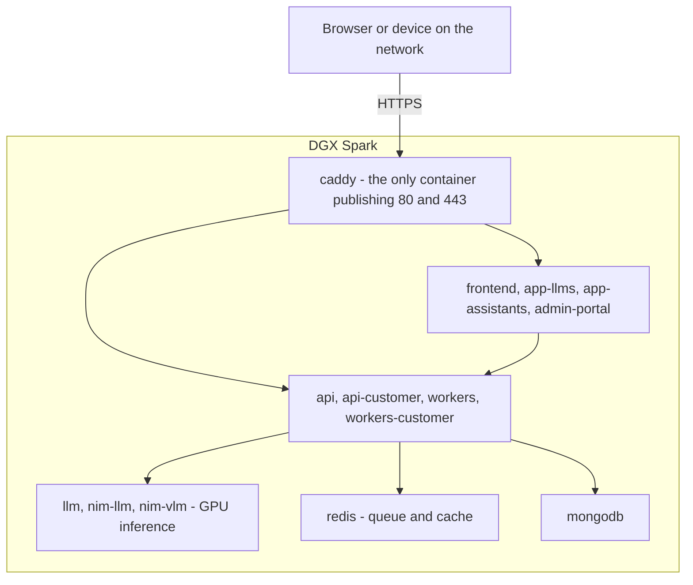
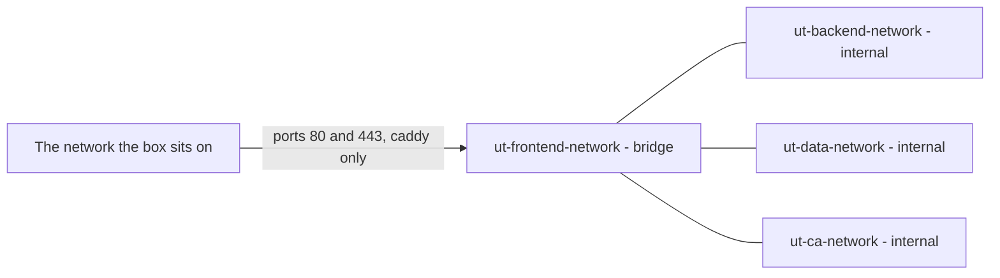

# Architecture

Two drawings, because one that held every container at once could not be read
and could not be reviewed. The first answers *where does a request go*; the
second answers *what can reach the internet*.

Per-container detail — ports, volumes, how to act on a service — is in
[the stack](the-stack.md).

## Where a request goes

<!-- Scope: the path of one browser request. Backups, the certificate authority
     and the App Builder add-on are deliberately absent. -->
<!-- Source of truth: compose.yaml:45-795, Caddyfile:31-82 -->
<!-- Date: 2026-09-18 -->
<!-- Target: github — status of "flowchart": rendered -->

**Description** — A browser on the local network reaches `caddy` over HTTPS.
`caddy` is the only container publishing ports 80 and 443, so it is the single
front door to the box. It serves six hostnames, all derived from `UT_DOMAIN`:
the apex goes to `frontend` and, under `/api/*`, to the APIs; `llms.`,
`assistants.` and `admin.` each go to their own web surface. Those surfaces
call the APIs, which are the only components that talk to the rest: GPU
inference, the Redis queue, and MongoDB. Nothing in the lower row is reachable
from a browser.

**Gaps** — One node per group, not one per container: `api` and `api-customer`
are two services, and so are the two worker sets. `builder.` and
`*.apps.` belong to the App Builder add-on and are not drawn. Not verified: the
diagram has not been seen rendered — no rendering engine is installed here.

## What can reach the internet

<!-- Scope: network membership and egress. Not the request path. -->
<!-- Source of truth: compose.yaml:795-811 for the declarations,
     compose.yaml:45-795 for membership -->
<!-- Date: 2026-09-18 -->
<!-- Target: github — status of "flowchart": rendered -->

**Description** — The stack declares four bridge networks. **Only
`ut-frontend-network` is reachable from outside**, and only through the two
ports `caddy` publishes. The other three are declared `internal: true`, which
means a container attached only to one of them has no route off the box — it
cannot call an external API, download anything, or be reached from the network.
The plain lines are not traffic: they mark that some containers sit on two
networks at once and therefore straddle the boundary. Which ones they are is
in the table below.

**Gaps** — The diagram does not say which direction traffic flows, because that
is the first drawing's job. The external `proxy` network used by the App
Builder's generated apps is not shown. Not verified: not seen rendered.

| Network | `internal` | Who is on it |
|---|---|---|
| `ut-frontend-network` | no | `caddy`, `frontend`, `api`, `api-customer`, the workers, `app-llms`, `app-assistants`, `admin-portal`, `llm` |
| `ut-backend-network` | **yes** | `api`, `api-customer`, the workers, `app-assistants`, `admin-portal`, `llm`, `nim-llm`, `nim-vlm`, `redis`, `files-backup` |
| `ut-data-network` | **yes** | `mongodb`, `mongodb-backup`, `api`, `api-customer`, the workers, `app-llms`, `app-assistants`, `llm` |
| `ut-ca-network` | **yes** | `caddy`, `step-ca` |

Read that table the other way round and it says what matters: `mongodb` is on
`ut-data-network` alone, `redis` and the two NIM containers on
`ut-backend-network` alone, `step-ca` on `ut-ca-network` alone. **None of the
four can reach the internet, and none of them publishes a host port.** The only
containers that straddle the boundary are the ones that have to answer a
browser.

## Where the data is

| What | Where | Carried by a backup |
|---|---|---|
| The databases | `ut-mongodb-data` volume | through `mongodb-backup`, which dumps them |
| Uploaded documents and generated artefacts | `/var/lib/understandtech/app-data` | yes, directly |
| The App Builder's projects | `/var/lib/understandtech/appbuilder` | yes, directly |
| The certificate authority's root | `/var/lib/understandtech/ca` | yes, directly |
| Model weights and caches | `ut-llm-*`, `ut-vllm-*`, `ut-nim-*-cache` volumes | no — re-downloaded |
| Your address, ports and secrets | `/etc/understandtech/.env` | no — regenerating it loses the database |

**`/var/lib/understandtech` is what a backup must cover.** The release
directory is reinstallable in a minute; the model caches cost a download, not
data. What the two backup services do with all this, and how to put it back, is
in [restoring](restore.md).

## Why it is shaped this way

**One front door.** Every hostname terminates on `caddy`, so there is one place
where TLS is decided and one place to look when something is unreachable. It
also means a service is exposed by being routed to, never by accident.

**Three of four networks have no exit.** An appliance sold on the promise that
data stays on the premises cannot rely on the application being careful. The
containers that hold documents, embeddings and model weights are on networks
that physically cannot reach the internet, so a mistake in application code
cannot turn into an exfiltration.

**One setting names the box.** `UT_DOMAIN` derives all six hostnames, every
public URL the services need, the Caddy site addresses and the published mDNS
names. Moving an appliance to another domain is a one-line change — see
[certificates and DNS](certificates-and-dns.md).
