# Installing

From a machine with nothing on it to a running appliance. Safe to interrupt and
safe to re-run: every step checks its own state before acting, so an install
that stopped halfway is resumed by running the same command again.

## What `ut-install` does, in order

```mermaid
flowchart LR
    PREFLIGHT["preflight - refuses a machine that cannot run it"]
    LOGIN["sign in to the registry"]
    FETCH["fetch the release"]
    CONFIGURE["write .env and generate every secret"]
    RESOLVE["check the address resolves, and the docker group"]
    CA["prepare the authority, create the networks"]
    PULL["pull the images"]
    START["start, then wait for every service to be healthy"]
    PERSIST["apply the certificate policy, install the boot service"]
    PREFLIGHT --> LOGIN --> FETCH --> CONFIGURE --> RESOLVE
    RESOLVE --> CA --> PULL --> START --> PERSIST
```

<!-- Scope: the order of the installer's steps. Not what each one checks. -->
<!-- Source of truth: ut-install:1006-1020 -->
<!-- Date: 2026-09-18 -->
<!-- Target: github — status of "flowchart": rendered -->



**Description** — The installer runs nine stages in a fixed order, and stops at
the first one that fails. It begins with a preflight that refuses a machine
that cannot run the stack, **before writing anything**. It then signs in to the
registry, fetches the release, writes `/etc/understandtech/.env` and generates
every secret, checks that the address resolves and that Docker is usable,
prepares the certificate authority's directory and the App Builder network,
pulls the images, starts the stack and waits for every service to report
healthy, and finally applies the certificate policy and installs the boot
service. Nothing is left running if an earlier stage failed.

**Gaps** — Nine boxes for thirteen internal steps: checking the address and the
Docker group are one box, as are the authority and the networks, and as are the
certificate policy and the boot service. The diagram does not show what each
stage checks or what it does when it finds the work already done. Not verified:
the diagram has not been seen rendered — no rendering engine is installed here.

## What you need first

- A machine with Docker 24 or newer and Compose v2, 250 GB free, 24 GB of RAM.
- A registry token for `ghcr.io`.
- The address the appliance will answer on. Not `understand.local` unless the
  machine really is on a flat local network — see
  [certificates and DNS](certificates-and-dns.md).

## 1 · Get the release

Releases are published at
`https://github.com/understand-tech/ai-in-a-box/releases`. **Take all five
files**, not just the package:

```bash
VERSION=2026.09.1
BASE=https://github.com/understand-tech/ai-in-a-box/releases/download/v$VERSION

mkdir ut-release && cd ut-release
for f in understandtech_${VERSION}_all.deb understandtech_${VERSION}_all.deb.sig \
         ut-verify release.pub SHA256SUMS; do
    curl -fsSLO "$BASE/$f"
done
chmod +x ut-verify
```

`SHA256SUMS` lists all four of the others, so downloading fewer makes the next
command report a failure on a release that is perfectly sound.

## 2 · Check it before you install it

```bash
sha256sum -c SHA256SUMS
./ut-verify understandtech_${VERSION}_all.deb
```

Expect four `OK` lines, then:

```
[ ok ] understandtech_2026.09.1_all.deb is signed by UnderstandTech
```

**This step is not a formality.** `dpkg` ships with `no-debsig`, so it installs
a local file without checking any signature at all — a package carried in on a
USB stick is verified by nothing unless you verify it. `ut-verify` needs
`openssl` and no network, and it refuses a package that was altered, signed by
another key, or not signed.

`./ut-verify --fingerprint` prints the key it carries. Compare it with the
fingerprint published out of band — on the contract or the website — the first
time you install on a site.

## 3 · Install the package

```bash
sudo apt-get install ./understandtech_${VERSION}_all.deb
```

`apt-get install ./file.deb` rather than `dpkg -i`: it pulls in `openssl` if the
machine lacks it.

Nothing starts. The package places files and tells you what to run next.

## 4 · Look before you touch anything

```bash
sudo ut-install --check
```

Changes nothing. It reports Docker's version, whether the GPU is reachable from
containers, free disk, RAM, and whether the address resolves. Every problem it
names is one you would otherwise meet halfway through, with services already
running.

The GPU check accepts either mechanism — the legacy `nvidia` docker runtime, or
CDI device files under `/etc/cdi` and `/var/run/cdi`. Recent NVIDIA toolkits
register no docker runtime at all, so a working machine can have none.

## 5 · Configure and start

```bash
sudo ut-install --domain box.example.com
```

It asks for the registry token, or reads it from `--token-file`, or takes it
from `UT_REGISTRY_TOKEN`. It is never passed on a command line and never written
to the log.

**Leave `--domain` out and it asks.** Answering nothing on a first install takes
`understand.local`, which resolves over mDNS on one flat network and nowhere
else, and which no public authority will certify — so every machine that uses
the appliance then has to install a root certificate by hand. An unattended run
with no terminal to ask on takes the same fallback and says so in the log.

The address also decides what gets set up: the mDNS publisher is installed only
for a `.local` name. On your own domain nothing is published here and Avahi is
not needed — the six names come from your zone.

What it does, in order: writes `/etc/understandtech/.env`, **generates every
secret**, checks the address resolves, prepares the certificate authority
directory, creates the App Builder network, pulls the images, starts the stack,
waits for the platform to be healthy, applies the certificate policy, and
installs the boot service.

**It hands back as soon as the platform answers**, usually within a minute of
the images being on the machine. The inference engines keep loading their model
weights in the background — up to 45 minutes on a first install — and the
installer says so, with the command to follow them. Sign in and configure while
they load.

Follow them with `sudo docker compose ps` in `/usr/share/understandtech`. It
needs `sudo`: the settings file it reads is `0600`.

## 6 · Write down what it prints at the end

Two secrets are shown **once**, on the terminal and not in the log:

- the **initial admin password**;
- the **backup password** (`BACKUP_FILES_PASSWORD`).

Losing the backup password makes every snapshot unreadable — including the
remote ones, including the certificate authority's root. There is no recovery
path. Put it wherever your organisation keeps such things before closing the
terminal.

## 7 · Verify

```bash
cd /usr/share/understandtech
docker compose ps
```

Every service should read `healthy`. Then open `https://<your-domain>` and sign
in with the admin password.

In the default TLS mode the browser warns on first visit: the certificate is
signed by an authority only this machine knows. That is expected — see
[certificates and DNS](certificates-and-dns.md) to make the warning go away, and
`ut-certificate` to obtain a publicly trusted one.

## Where things go

| Path | Holds | On upgrade |
|---|---|---|
| `/usr/share/understandtech/` | compose files, Caddy configuration | replaced |
| `/etc/understandtech/` | `.env` — your address, ports and secrets | **never touched** |
| `/var/lib/understandtech/` | databases, documents, the authority's root | untouched, kept even on removal |
| `/usr/bin/ut-*` | the tools | replaced |

`.env` is generated by `ut-install`, so it is not part of the package and an
upgrade has nothing to overwrite. Compose reads it through a link from the
release directory, which therefore holds no state of its own.

**`/var/lib/understandtech` is what a backup must cover.** The rest is
reinstallable in a minute.

## Useful options

| Option | When |
|---|---|
| `--check` | Before anything. Changes nothing. |
| `--domain NAME` | The address the platform answers on. Asked for when omitted. |
| `--token-file PATH` | Read the registry token from a file instead of a prompt. |
| `--skip-pull` | Images are already on the machine — an air-gapped install. |
| `--no-autostart` | Do not install the boot service. |
| `--dir PATH` | Another release directory. Defaults to `/usr/share/understandtech`. |
| `--health-timeout N` | Longer than 3600 s if the machine is slow to load models. |

## If it stops

It says which step and which line. Nothing is rolled back, and the same command
resumes from there. The full log is at `/var/log/ut-install.log`.

Three failures account for almost all of them — the GPU not reachable from
containers, Docker out of address space, and an address that does not resolve.
Each one, with what to do about it, is in
[when it breaks](when-it-breaks.md#during-an-install).

## Installing beside something already running

A test install next to a live one needs its own names, its own directory, its
own data root and its own ports. Take a copy of the release directory rather
than the packaged one, so the package can be upgraded without disturbing it:

```bash
cp -r /usr/share/understandtech ~/ut-lab
cd ~/ut-lab
```

Then in `~/ut-lab/.env`:

```bash
COMPOSE_PROJECT_NAME="lab"
RESOURCE_PREFIX="lab"
CONTAINER_PREFIX="lab"
DATA_ROOT="/var/lib/ut-lab"
COMPOSE_FILE="compose.yaml:compose.no-gpu.yaml"
COMPOSE_PROFILES=""
UT_HTTP_PORT="8180"
UT_HTTPS_PORT="8543"
UT_INTERNAL_PORT="9444"
MONGODB_HOST_PORT="27118"
```

```bash
sudo ut-install --dir ~/ut-lab --domain lab.example.test --no-autostart
```

Four things there are not optional:

- **`COMPOSE_PROJECT_NAME`** — three services carry no fixed container name, and
  Compose names those after the project. Setting only the prefixes leaves them
  colliding.
- **`--no-autostart`** — the boot service is a system-wide unit. Installing it
  from a second directory repoints the one that starts the live stack, and the
  next reboot brings up the wrong one.
- **`compose.no-gpu.yaml` with no profiles** — `llm` requests a GPU even when
  the inference engines are switched off, and two stacks competing for the same
  device is how both end up failing.
- **A different address** — two Caddy instances claiming the same name resolve
  unpredictably.

Before starting it, check what the configuration really names:

```bash
docker compose config | grep -E '^ *(container_name|name): ut-'
```

Anything printed there belongs to the live stack. Expect no output.
