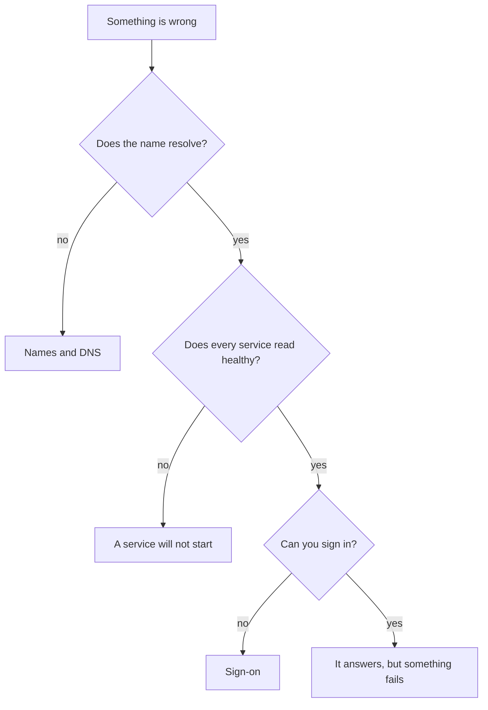

# When it breaks

For the operator with an appliance that is not doing what it should. After
reading you will know which layer the problem is in, and the one command that
tells you.

This page collects what the other documents say about failure, so there is one
place to look. Each entry says where the full explanation lives.

## Start here

Three commands, in this order. Most problems are identified by the first two.

```bash
cd /usr/share/understandtech
docker compose ps                      # what is running, and what is healthy
docker compose logs --tail 100 api     # or whichever service is not healthy
sudo ./setup-autostart.sh --status     # both boot units, plus every service
```

If the install itself did not finish, the log is at `/var/log/ut-install.log`
and it names the step and the line it stopped on.

## Which layer

<!-- Scope: routing a symptom to the layer it belongs to. Not the fixes
     themselves, which are in the sections below. -->
<!-- Source of truth: docs/install.md, docs/configuration.md,
     docs/certificates-and-dns.md, docs/using-the-platform.md -->
<!-- Date: 2026-09-18 -->
<!-- Target: github — status of "flowchart": rendered -->



**Description** — Four questions, asked in order, each ruling out a layer.
First, does the name resolve at all: if not, the problem is DNS or mDNS and
nothing on the appliance is at fault. If it resolves, does every service read
`healthy`: if not, the problem is a container. If they are all healthy, can you
sign in: if not, the problem is the identity provider or the sign-on settings,
not the appliance. If you can sign in, the appliance is up and the problem is
in what you are asking it to do. Ask them in this order — a service that looks
broken from a browser is very often a name that resolves somewhere else.

**Gaps** — The diagram routes a symptom; it does not fix anything. It assumes
you can reach the machine's shell. Not verified: the diagram has not been seen
rendered — no rendering engine is installed here.

## During an install

**The GPU is not reachable from containers.** The preflight says so. Install the
NVIDIA container toolkit, then re-run. The check accepts either mechanism — the
legacy `nvidia` docker runtime, or CDI device files under `/etc/cdi` and
`/var/run/cdi` — so a working machine can have no docker runtime registered at
all.

**Docker has no address space left.** `Error response from daemon: all
predefined address pools have been fully subnetted`. The stack needs four
networks, and a machine that has hosted generated applications keeps theirs long
after they stop. `sudo ut-install --check` catches it before anything is
written. Full explanation and the fix:
[starting states](starting-states.md#docker-address-pools-which-run-out-quietly).

**The address does not resolve.** The appliance starts, but nothing reaches it
by name. Either publish the six DNS records, or re-run with a `--domain` that
resolves. See [certificates and DNS](certificates-and-dns.md).

**It stopped halfway.** Nothing is rolled back and the same command resumes from
where it stopped. Re-run it. See [installing](install.md#if-it-stops).

## After changing a setting

**The stack will not start.** Almost always a required variable emptied — seven
of them refuse an absent or empty value. The error names the one. See
[configuration](configuration.md#the-four-kinds-of-variable).

**A service restarts in a loop.** `docker compose logs <service>`. Usually a URL
pointing at an address that no longer resolves.

**Users are signed out after changing the address.** Expected, not a fault: the
OIDC redirect URI derives from `UT_DOMAIN`, so it changed with it. They sign in
again.

**The browser warns again.** The certificate no longer matches the name, or the
authority changed. See [certificates and DNS](certificates-and-dns.md).

**The edit disappeared.** You edited `.env` rather than
`/etc/understandtech/local.env`. `.env` is rebuilt from scratch on every
`ut-install` run. See [configuration](configuration.md).

**A typo in `UT_INGRESS_MODE` produced a directory.** `docker compose config`
does not catch it — docker creates a directory where the missing fragment
should be. `sudo ./setup-autostart.sh --check` is what catches it.

## In service

**A service stays unhealthy.** Read its log first. The inference engines are the
usual case and are usually not a fault: they load model weights on first start,
which takes far longer than the other services.

**Compose warns about a volume created for another project.**
`WARN volume "ut-mongodb-data" already exists but was created for project "ut"`.
A label mismatch, not a data problem — compose mounts the right volume and the
stack runs. **Do not "fix" it** by marking the volumes `external: true`: compose
would then refuse to create them and every fresh install would break. See
[the stack](the-stack.md#volumes).

**The appliance did not come back after a reboot.** The boot service starts from
local images only, so it never stalls on a registry timeout — but it also never
pulls. If an image tag changed and nobody pulled as a normal user, the images
are not there. `sudo ./setup-autostart.sh --status`, then pull and start by
hand. See [the stack](the-stack.md#auto-start-on-boot).

**A generated application has no address.** On a `.local` domain the alias
service rescans every 10 seconds, so give it that long. On your own domain a
`*.apps.<UT_DOMAIN>` record has to exist.

## Names and DNS

**Nothing resolves, on a `.local` domain.** mDNS needs `avahi-daemon` and
`avahi-utils`, and it does not cross network segments — a corporate network with
client isolation blocks it. Check the publisher is running, then fall back to
the machine's address.

**Nothing resolves, on your own domain.** Six names have to exist, plus
`*.apps.` if the App Builder is enabled. See
[certificates and DNS](certificates-and-dns.md#the-names-to-publish).

**Some names resolve and others do not.** mDNS has no wildcards, so each name is
published separately. A name added after the publisher started appears at the
next rescan.

## Sign-on

**Sign-in is refused for one person.** Their account is not authorised for this
application in your identity provider. That is not fixed on the appliance.

**Sign-in is refused for everyone, after an address change.** The redirect URI
moved with `UT_DOMAIN` and the identity provider still holds the old one.
Update it there, on both sides.

**There is no sign-in form at all.** Sign-on was never configured. Nobody can
use the platform until it is. See
[first-run configuration](first-run-configuration.md#2--configure-sign-on).

## What this document does not cover

**Putting data back.** Every restore procedure is [restoring](restore.md), which
also says what a restore does not cover.

**Going back to a previous version.** See [updating](update.md).

**Anything a user sees rather than an operator.** What a person at the customer
should do about a certificate warning or a refused sign-in is written for them
in [using the platform](using-the-platform.md).

**Failures inside a generated application.** The App Builder starts each one as
its own compose project; its logs are its own.

**A defect in the product itself.** Nothing here distinguishes a
misconfiguration from a bug. When the log names no cause, collect
`docker compose ps`, the failing service's log, and what you were doing.
